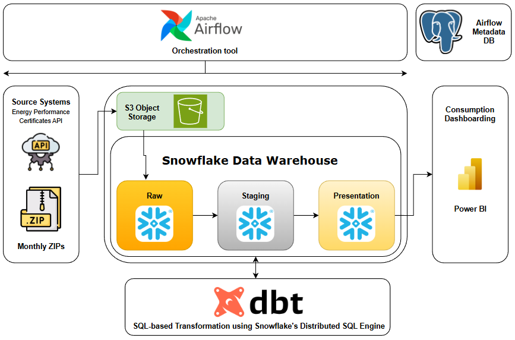
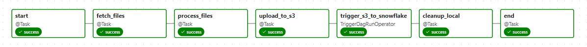
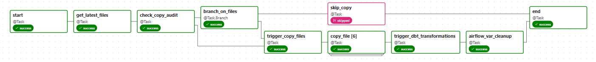
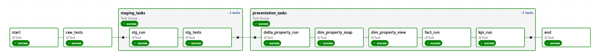
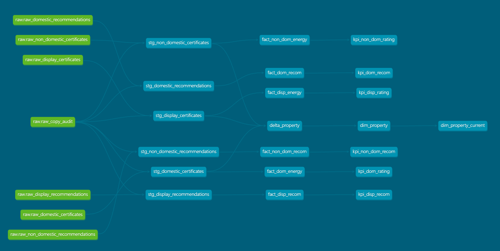
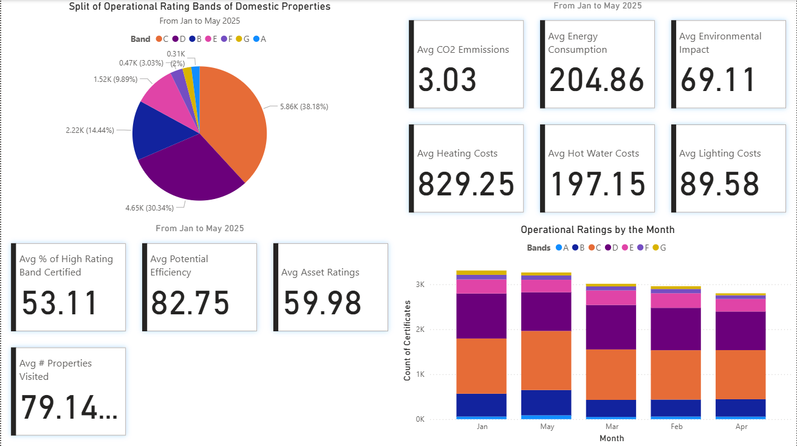
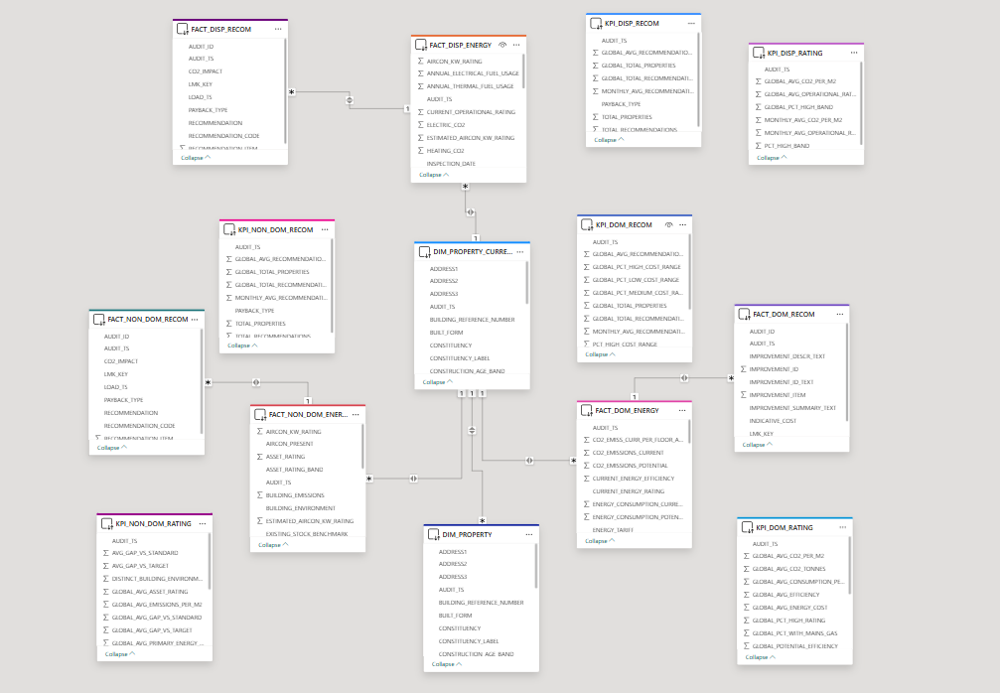

# Monthly EPC Pipeline

This README documents the Monthly EPC Data Engineering Pipeline built with **Airflow**, **AWS S3**, **Snowflake**, **DBT**, and **Power BI**.

---

## Table of Contents
1. [Project Overview](#project-overview)
2. [Architecture](#architecture)
3. [Data Contract & Modeling Details](#data-contract--modeling-details)
4. [Repository Layout](#repository-layout)
5. [Airflow DAGs](#airflow-dags)
6. [Snowflake Setup](#snowflake-setup)
7. [DBT Project](#dbt-project)
8. [Power BI Layer](#power-bi-layer)
9. [Running the Project](#running-the-project)
10. [Data Quality](#data-quality)
11. [Design Decisions](#design-decisions)
12. [Future Enhancements](#future-enhancements)
13. [Links](#links)

---

## Project Overview

**Name:** Monthly EPC Pipeline  
**Purpose:** An `ELT` pipeline which performs ingestion and transformation of EPC (Energy Performance Certificates) data for England & Wales from the Department for Levelling Up, Housing & Communities, at a monthly frequency.

The pipeline ingests monthly zips from the [Energy Performance Certificates API](https://epc.opendatacommunities.org/docs/api), stores the required raw CSVs (certificates and recommendations) in **S3**, loads them into **Snowflake** (with auditing), and runs **DBT transformations** to produce staging, fact, and KPI models, SCD2 dimension snapshot, and view on current snapshots, which are used by **Power BI dashboards**.

---

## Architecture

**Technologies Used:**
| Component | Technology | Role |
|------------|-------------|--------------|
| Ingestion | Apache Airflow | Orchestrates data extraction and loading into Snowflake |
| Storage | AWS S3 | Stores raw data files from source APIs |
| Data Warehouse | Snowflake | Manages structured data for transformation |
| Transformation | DBT | Models data, handles SCD2 snapshots, and testing |
| Containerization | Docker | Ensures reproducible local and cloud environments |
| Visualization | Power BI | Connects to Snowflake Warehouse and extracts data and feeds into visuals |

**Data Flow:**
```
API → Ingestion DAG → S3 → s3_to_snowflake DAG → Snowflake RAW Tables → DBT Transformations → Presentation Layer → Power BI Dashboard
```

**Architecture Diagram:**  
<p align="center">
  
</p>

**Links:**
- [DAGs](airflow/dags)
- [Docker Compose File](docker-compose.yml)
- [Custom DBT-Snowflake Image](dbt/Dockerfile.dbt-snowflake)
- [.env Template](copy.env)

---

## Data Contract & Modeling Details

Detailed documentation on the EPC dataset, data contract assumptions, surrogate key strategy, snapshotting, and data quality enforcement is available here: [Data Contract](./Data-Contract.md)

---

## Repository Layout
[Full Project Structure](docs/file_structure.txt)

```
.
├── airflow/
│   └── dags/
├── dbt/
│   └── dbt_epc/
├── snowflake/
├── src/
│   ├── ingestion/
│   └── utils/
├── docker-compose.yml
└── .env
```

---

## Airflow DAGs

1. [dev_ingestion](airflow/dags/dev_ingestion.py)
Fetches latest EPC data, extracts, processes, and uploads to S3.

<p align="center">
  
</p>

2. [s3_to_snowflake](airflow/dags/s3_to_snowflake.py)
Copies CSVs from S3 to Snowflake using COPY INTO commands and maintains an audit log.

<p align="center">
  
</p>

3. [dbt_transformations](airflow/dags/dbt_transformations.py)
Runs DBT tests, transformations, and snapshots for the data warehouse layer.

<p align="center">
  
</p>

---

## Snowflake Setup

#### Snowflake Objects:
- Compute → COMPUTE_WH (the default)
- Database → EPC_DB
- Schemas → RAW, STAGING, PRESENTATION

#### What is involved:
1. Creation of the necessary compute/virtual-warehouse, database/warehouse, initial schemas, roles, and users.
2. Creation of the external data integration for connecting the object storage to snowflake, defining a file format, and stages.
3. Defining the DDLs of the table to which the copy will be performed to.
4. Running copy statements to load the data using the integration, file formats, and stages accordingly.

> You can follow the prefix of the sql scripts in the snowflake folder, the s3_copy script is not meant to be run manually but using airflow tasks.

[Snowflake Scripts](snowflake)

---

## DBT Project

[DBT Project Folder](dbt/dbt_epc)

#### Folder Structure Overview:
```
dbt_epc/
├── models/
│   ├── raw/
│   ├── staging/
│   └── presentation/
├── snapshots/
└── dbt_project.yml
```
[Full DBT Project Structure](docs/dbt_project_structure.txt)

#### DBT Models DAG:
<p align="center">
  
</p>

---

## Power BI Layer

The Power BI dashboard visualizes some key metrics and trends.

#### Dashboard:
<p align="center">
  
</p>

#### Data Model:
<p align="center">
  
</p>

[Power BI Dashboard](epc-dashboard.pbix)

---

## Running the Project

[Docker Compose File](docker-compose.yml)

This section explains how to set up, configure, and run the EPC Data Engineering pipeline on any compatible system using Docker, Docker Compose, and Python virtual environment managed by **uv** (by [Astral](https://docs.astral.sh/uv/)).

#### 1. Prerequisites

Ensure the following are installed and configured:

* **Docker**
* **Docker Compose** (plugin or standalone)
* **uv** package manager
* **Snowflake account** with required roles and permissions
* **AWS account** with access to an S3 bucket for staging data
* **Python 3.8+** (for generating Fernet key)
> All of the following steps will be done in the terminal staying at the project root.

#### 2. Environment Configuration

After cloning the repository, 

* Initialize the new virtual environment (managed by `uv`):

    ```bash
    uv venv
    source .venv/bin/activate
    ```

    `uv` automatically creates `.venv/` with an isolated Python environment.

* Then install Dependencies from `pyproject.toml`,

    The repository contains a `pyproject.toml` file that defines dependencies (Airflow, dbt, boto3, etc.).
    Use `uv` to install all dependencies efficiently:

    ```bash
    uv pip install -e .
    ```

    This reads the `[project]` section of `pyproject.toml` and installs dependencies locally, editable for development.

* Verify the installation:

    ```bash
    uv pip list
    ```

* Then create and configure the environment file:

    ```bash
    cp copy.env .env
    ```

    Update `.env` with your credentials and keys:

    | Variable                                                    | Description                                   |
    | ----------------------------------------------------------- | --------------------------------------------- |
    | `POSTGRES_USER`, `POSTGRES_PASSWORD`                        | Airflow metadata database credentials         |
    | `AIRFLOW__CORE__FERNET_KEY`                                 | Fernet key for encrypting Airflow connections |
    | `SNOWFLAKE_USER`, `SNOWFLAKE_PASSWORD`, `SNOWFLAKE_ACCOUNT` | Snowflake credentials                         |
    | `AWS_ACCESS_KEY_ID`, `AWS_SECRET_ACCESS_KEY`                | AWS credentials for S3 access                 |

* Then generate a new Fernet key:

    ```bash
    python3 -c "from cryptography.fernet import Fernet; print(Fernet.generate_key().decode())"
    ```

    Replace the key in `.env`:

    ```
    AIRFLOW__CORE__FERNET_KEY=<your_generated_key>
    ```

#### 3. Build Custom dbt-Snowflake Image

A custom dbt image is required to be able to interact with the dbt container so that we can work with Snowflake using the dbt core commands.
From the root directory, run:

```bash
docker build --no-cache -t dbt-snowflake:custom -f ./dbt/Dockerfile.dbt-snowflake .
```

This builds a fresh image without caching intermediate layers — helpful if you’ve updated dependencies or credentials.

#### 4. Starting and Managing Containers

Start all services in detached mode:

```bash
docker-compose up -d --remove-orphans
```

Stop all services:

```bash
docker-compose down
```

Restart a specific container (e.g., `airflow-webserver`):

```bash
docker-compose restart airflow-webserver
```

#### 5. Checking Logs and Credentials

To troubleshoot or find generated credentials (e.g., Airflow admin username/password):

```bash
docker logs <service_name> > ./logs/<service_name>.log 2>&1
```

Inspect logs for:

* Airflow UI URL, username, and password
* Snowflake connection initialization messages
* dbt profile configuration output

*(Tip: always clear old logs or use `.gitignore` for `logs/` folder.)*

#### 6. Initialize Snowflake Resources

Before running any DAGs, execute the three SQL setup scripts located in the `snowflake/` directory:

1. `1_dbt_snowflake_init.sql` – creates database, schemas, and roles.
2. `2_integrations_fileformats_stages.sql` – defines Snowflake sequences, stages, file formats, and integrations with S3.
3. `3_raw_tables_ddl.sql` – creates raw layer tables and the COPY audit table.

You can run these scripts in:

* **Snowflake UI Worksheet**, or
* **SnowSQL CLI** (`snowsql -f <script.sql>`)

Refer to Snowflake setup tutorials if unfamiliar with executing DDLs in your environment.

#### 7. Validate DBT & Airflow Connections

Once containers are running:

* Enter the DBT container shell:

  ```bash
  docker exec -it dbt bash
  ```

* Test DBT connection:

  ```bash
  dbt debug
  ```

  This confirms that the `profiles.yml` file is configured correctly for Snowflake. If not make sure you have created the right snowflake objects, roles, and users and have also mentioned the right Account > Connect a tool to Snowflake > Account Identifier (the one with the hyphen `-`)

* Downlaod the necessary DBT packages:

   ```bash
   dbt deps
   ```

* Verify Airflow–Snowflake connection:
  Check Airflow logs for auto-creation of the Snowflake connection. A default connection (`snowflake_default`) should appear in the Airflow UI.

#### 8. Running the DAGs

With all services running and connections validated:

1. Open the Airflow UI (typically at `http://localhost:8080`), and login using the admin password you have found in the airflow logs.
2. Enable and trigger the DAGs in order:

   * `dev_ingestion` → Scheduled monthly (fetches and uploads latest EPC data).
   * `s3_to_snowflake` → Triggered automatically upon successful ingestion DAG completion.
   * `dbt_transformations` → Triggered after successful Snowflake COPY and its validation.
3. You may also trigger individual DAGs manually if required — use Airflow Variables to pass parameters (e.g., dataset month, file paths), just make sure that you have mentioned the right variable name in the airflow UI (`epc_month_tag (YYYY-MM)` and `manual_file_list`).

#### 9. Expected Workflow Execution

1. `dev_ingestion` downloads and uploads monthly EPC CSVs to S3.
2. `s3_to_snowflake` copies those files into Snowflake RAW tables while logging results in `RAW_COPY_AUDIT`.
3. `dbt_transformations` runs dbt models, tests, and snapshots to build staging and presentation layers.
    > The first run of the dbt transformation DAG will fail because the staging models have not been created yet, so for the first run, once the DAG fails please run `dbt run -s tag:staging` and then rerun the DAG.
4. The Power BI dashboard refreshes from the updated Snowflake presentation tables.

#### 10. Common Checks and Troubleshooting

| Scenario                    | Command or Action                          |
| --------------------------- | ------------------------------------------ |
| Check container health      | `docker ps`                                |
| Debug dbt container         | `docker exec -it dbt-snowflake bash`       |
| Check Snowflake stage files | Run `LIST @stage_name` in Snowflake        |
| View failed task logs       | Airflow UI → Task → Logs                   |
| Restart stuck scheduler     | `docker-compose restart airflow-scheduler` |

*(Tip: Always confirm S3 → Snowflake → DBT connectivity before triggering all DAGs together. Check for tutorials on how to do testing.)*

* To get the DBT docs:

   ```bash
   dbt docs generate
   dbt docs serve --port 8081 --host 0.0.0.0
   ```

#### 11. System Cleanup

If you want to remove all containers, networks, and volumes for a clean rebuild:

```bash
docker-compose down -v
docker system prune -af
```

Then rebuild and restart as per step 3.

---

## Data Quality

The pipeline implements multiple layers of data validation and integrity checks to ensure consistent and trustworthy data across all stages:

1. Foundational DBT Tests:
   Standard DBT tests such as `unique`, `not_null`, and `relationships` are applied across raw, staging, and presentation models to enforce key integrity and prevent referential inconsistencies.

2. Extended Data Quality via `dbt-expectations`:
   Advanced validation rules leverage the [dbt-expectations](https://hub.getdbt.com/metaplane/dbt_expectations/latest/) package for comprehensive column-level quality checks, including:

   * Range validation: `expect_column_values_to_be_between` — ensures numeric or date fields fall within expected boundaries.
   * Accepted values validation: `expect_column_distinct_values_to_be_in_set` — enforces categorical columns (e.g., EPC bands, property types) to contain only valid predefined values.

3. COPY Audit Validation and Rollback Mechanism:
   Prior to triggering dbt transformations, the pipeline verifies that all file COPY operations are both **executed and successfully audited** in the `RAW_COPY_AUDIT` table.

   * If a COPY operation has committed data to Snowflake **without a corresponding audit entry** (e.g., due to mid-process failure), the same airflow copy task **automatically detects and removes the untracked data** to maintain full audit alignment and data consistency.

---

## Design Decisions

#### Data Modeling & Architecture

1. Layered Model Design:

   * RAW Layer: Append-only tables preserving source fidelity.
   * Staging Layer: Incremental models for efficient reprocessing.
   * Presentation Layer: Incremental or table materializations based on downstream use-case.
   * Dimensional Modeling: Slowly Changing Dimensions (SCD2) implemented via **dbt Snapshots** of the `dim_property` table, with **MD5 hashing** for change detection and a `dim_property_current` view for active property records.

2. Audit & Lineage:

   * Centralized `RAW.RAW_COPY_AUDIT` table maintains detailed lineage for all file loads.
   * Each raw table record is tied to a unique `AUDIT_ID`, enabling full traceability between ingestion, transformations, and presentation models.

3. Idempotent Design:

   * Ensures repeated runs of the same DAG or task do not produce duplicate records or trigger redundant uploads.
   * The COPY audit table serves as a safeguard to prevent re-ingestion or re-copying of previously processed files.

#### Orchestration & Automation

4. Dynamic Task Generation:

   * Airflow DAGs use **Dynamically Mapped Tasks**, allowing scalable and flexible ingestion of variable number of datasets (e.g., newly added or missing months).

5. Trigger Dependencies:

   * Downstream DAGs are triggered only when no upstream tasks succeed, using the `none_failed_min_one_success` rule to ensure reliability and prevent partial pipeline execution.

6. Controlled Execution Flow:

   * dbt transformations are blocked/failed until all file copies are confirmed `LOADED` in the audit table, ensuring data consistency and pipeline integrity. And the copy is audit only after the copy is successful, if either the copy or audit steps fail then the tasks is considered a fail and the newly copied records are deleted.

7. Isolated DAG Operations:

   * Each DAG can also be executed _individually_ through **Airflow Variables**, providing flexibility for partial or ad hoc reprocessing.


#### Data Quality & Governance

8. Constraint Validation via DBT:

   * Since **Snowflake DDL constraints are informational only** (not enforced), key and uniqueness checks are implemented as **DBT tests** at each layer to ensure data integrity.

9. Enhanced Testing Framework:

   * The [dbt-expectations](https://hub.getdbt.com/metaplane/dbt_expectations/latest/) package is integrated for advanced data quality assertions (e.g., ranges and accepted values checks) beyond standard dbt tests.

10. Role-Based Access Control (RBAC):

    * Dedicated `TRANSFORM` role and `dbt_user` account in Snowflake enforce least-privilege principles and isolate transformation workloads from administrative access.


#### Reliability & Maintenance

11. Default Snowflake Connection Setup:

    * On every Airflow container startup, a default Snowflake connection is automatically recreated, ensuring consistent and seamless integration across sessions.
    * The encryption in the airflow container is made consistent using a constant Fernet key, which is fed as an environment variable at the start of docker container.

12. Comprehensive Logging & Error Handling:

    * Extensive try–except structures and logging statements implemented across ingestion, copy, and transformation scripts to enhance traceability and debugging.

---

## Future Enhancements

1. Continuous Integration / Continuous Deployment (CI/CD):

   * Implement automated workflows using **GitHub Actions** or **Jenkins** to validate, build, and deploy DAGs, dbt models, and documentation.

2. Managed Orchestration:

   * Migrate from local Dockerized Airflow to **Managed Workflows for Apache Airflow (MWAA)** or **Astronomer Cloud** for better scalability, reliability, and monitoring.

3. Data Observability:

   * Integrate monitoring tools like **Monte Carlo**, **OpenLineage**, or **Great Expectations** to automate anomaly detection and lineage visualization.

4. Better Automated Data Backfills:

   * Build Airflow utilities to auto-detect missing historical months and trigger targeted backfills without manual intervention.

7. Infrastructure as Code (IaC):

   * Define infrastructure components (Airflow, S3, Snowflake stages, roles) via **Terraform** for reproducibility.

7. Advanced Analytics Layer:

   * Extend presentation models to include KPI trends, energy efficiency scoring, and property clustering analysis using dbt exposures or Python-based transformation layers.

---

## Links

- [Project Structure](docs/file_structure.txt)
- [DBT Project Structure](docs/dbt_project_structure.txt)
- [Docker Compose](docker-compose.yml)
- [dbt Project](dbt/dbt_epc)
- [Airflow DAGs](airflow/dags)
- [GitHub Repo Commits](https://github.com/DhasharadhaReddy22/epc_pipeline/commits)